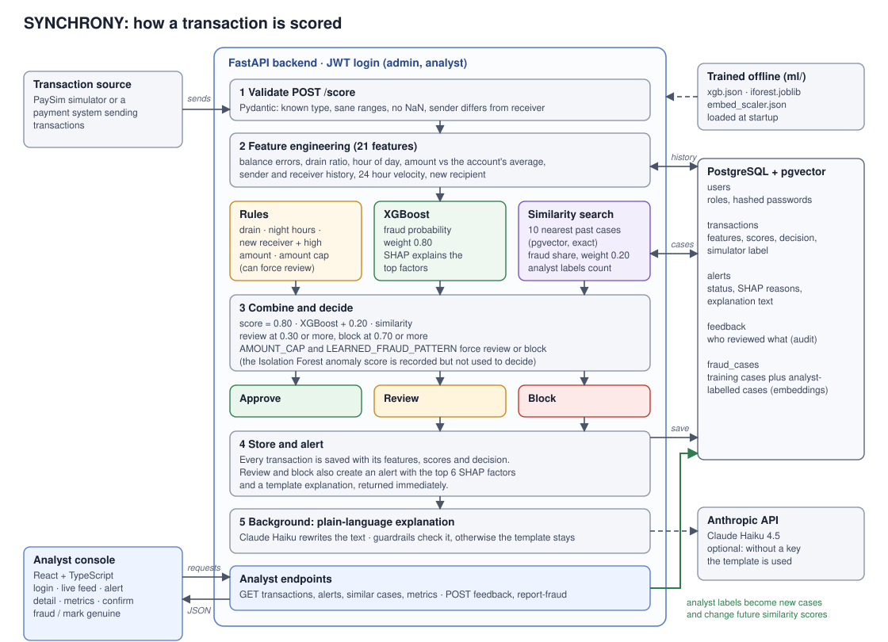

# Architecture

## How a transaction flows
1. **Validate.** `POST /score` needs a JWT. The payload is checked for type, ranges, NaN and sender differing from receiver. Bad input gets a 422 and nothing is stored.
2. **Features.** 21 features are built from the transaction and the account history in Postgres: balance errors, drain ratio, hour of day, amount against the account's average, sender and receiver history, 24 hour velocity and whether the receiver is new.
3. **Three signals.**
   - *Rules:* full balance drain, night hours, new receiver with a high amount, amount cap. They carry no weight in the score. Only the amount cap and the learned pattern can force a decision.
   - *XGBoost:* fraud probability, with SHAP factors for explanations.
   - *Similarity search:* the 10 nearest past cases in pgvector (exact search). The fraud share is the similarity score.
4. **Decide.** `score = 0.80 x XGBoost + 0.20 x similarity`. At 0.30 or more the transaction goes to review, at 0.70 or more it is blocked. Forced flags can raise the decision but never lower it. The Isolation Forest anomaly score is stored for analysis but does not affect the decision.
5. **Store and alert.** Every transaction is saved. Review and block also create an alert with the top 6 SHAP factors and a template explanation, returned in the response.
6. **Explain.** In the background, Claude Haiku rewrites the explanation in plain language. Guardrails check the output and the template stays if the check fails, the call times out, the rate limit (30 a minute) is hit or there is no API key.
7. **Analyst loop.** Analysts open alerts in the console and confirm fraud or mark genuine. Each label is stored in `feedback` (audit trail) and as a new case in `fraud_cases`. Three or more net analyst-confirmed fraud cases among the 10 nearest neighbours force review, and five or more force block. See [phase3_adaptive_loop.md](phase3_adaptive_loop.md).

## Where things live
| Part | Location |
|---|---|
| API, scoring, LLM, tests | `backend/app` and `backend/tests` |
| Training code, models, reports | `ml/` (models in `ml/models`) |
| Console | `frontend/src` |
| Simulator and red-team script | `backend/scripts` |
| Database | Postgres with pgvector, via `docker-compose.yml` |

`docs/architecture.svg` is a hand-drawn SVG, so it renders on GitHub and in any browser without extra tools.
